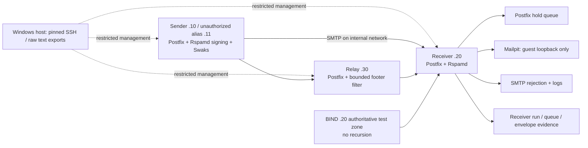

# Phishing Investigation & Email Authentication Lab

An isolated training lab that explains what SPF, DKIM and DMARC establish, and what an analyst
still needs to investigate. Real Postfix/Rspamd processing produces signed messages, DNS failures,
queue holds, SMTP rejections and forwarding outcomes. All identities and messages are synthetic.

**Local implementation and agent review complete.** There is no remote repository or publication. See [REVIEW_HANDOFF.md](REVIEW_HANDOFF.md)
for verified results and remaining manual/GitHub checks. The completed review is in [docs/REVIEW.md](docs/REVIEW.md). See [evidence/INDEX.json](evidence/INDEX.json)
for 31 passing authentication scenarios; failed and partial attempts remain separate.

## Architecture and trust



Experiment network: VirtualBox internal `PEAL-experiment`, `10.77.0.0/24`. Management network:
existing host-only adapter, host `192.168.56.1`, guests `.50/.51/.52`, SSH input only from the host.
No NAT, bridged experiment NIC, default route or packet forwarding. Guest IPv6 is disabled.
Both guest firewall directions default to drop. Direct internal-network access to Mailpit and
administrative endpoints is blocked. Windows DNS, firewall and existing adapter settings were preserved.

Submitted Authentication-Results, Received and Message-ID are claims. Receiver trust comes from
pinned SSH collection, fresh run nonce, queue ID, actual socket IP/envelope, and correlated SMTP/log
evidence. Ingress removes submitted Authentication-Results/Received-SPF/X-Rspamd headers while the
original export retains them. A copied authserv-id or header position never establishes trust.

## Requirements

Tested: Windows 11 Home, VirtualBox 7.2.6r172322, Python 3.13, PowerShell, Windows OpenSSH,
64 GiB host RAM, Intel i7-11800H. Guests are Debian 13.7.0: sender 1536 MiB/2 vCPU/6 GiB dynamic
disk, receiver 2048 MiB/2 vCPU/8 GiB, relay 1024 MiB/1 vCPU/6 GiB. Keep at least 8 GiB host disk
free; dynamic limits are not the actual host space consumed. Hyper-V/WSL/Docker are not used.

Guest software: Postfix 3.10.13, Rspamd 4.2.1, BIND 9.20.29, Redis 8.0.2, Swaks 20240103.0,
Mailpit 1.31.3. Exact Debian package revisions are preserved in scenario `versions-config-time.txt`.
Python runtime requires only the standard library; Bandit 1.9.4 is a development check.

## Run the existing lab

From this repository in PowerShell, start only its named guests if stopped:

```powershell
& 'C:/Program Files/Oracle/VirtualBox/VBoxManage.exe' startvm PEAL-sender --type headless
& 'C:/Program Files/Oracle/VirtualBox/VBoxManage.exe' startvm PEAL-receiver --type headless
& 'C:/Program Files/Oracle/VirtualBox/VBoxManage.exe' startvm PEAL-relay --type headless
pwsh -NoProfile -File tools/Test-LabReady.ps1 -IncludeRelay -OutputDirectory evidence/my-fresh-gate
python tools/lab.py S01 --output evidence/my-fresh-baseline
python tools/lab.py S07q --output evidence/my-fresh-hold
python tools/lab.py S09m --output evidence/my-fresh-forwarding
python -m tools.rotation --output evidence/my-fresh-rotation
python -m tools.evidence verify evidence/my-fresh-baseline
```

Use fresh output directories. A gate failure blocks sending. Review the known lab-local connectivity
tests in `tools/guest_connectivity.py` and the existing `evidence/isolation-02/connectivity.json`.
After host suspension, `python -m tools.sync_clock --output evidence/my-clock-recovery` repairs only
the marked guest clocks; rerun the gate. Never change existing evidence timestamps.

`python -m tools.reset_replay --output evidence/my-reset-replay` verifies completed evidence before
reset, exports pending queue entries, removes only individually exported entries linked by role, queue ID, scenario and fresh run nonce
to a verified controlled collection, restores baseline config, clears authentication caches by restart, and replays nine
cases. Keys, report data and Mailpit capture remain retained. Unknown or unlinked queue entries remain retained;
reset is a semantic reset, not VM destruction or a full database wipe. Run tools serially: they share
guest staging files and policy state. Avoid host sleep while a case is running.

## Build fresh guests

Follow [docs/SETUP.md](docs/SETUP.md). The `.private` installer, signing/SSH keys, known hosts and
VM files are deliberately absent from Git. An exported repository alone cannot authenticate into
these guests. Generate fresh disposable keys for a new installation and inspect scripts before use.
Temporary NAT is provisioning only; remove it before enabling experiments.

## Demonstration

| Scenario | Measured behavior |
|---|---|
| S01 | SPF/DKIM/DMARC pass, captured through receiver |
| S02/S02a | Unauthorized IP fails SPF; valid aligned DKIM independently rescues DMARC |
| S03/S04 | Passing but unaligned SPF/DKIM does not pass DMARC |
| S05a | Altered signed body breaks DKIM; aligned SPF still passes DMARC |
| S06r/S06s | Combined sibling identities pass relaxed alignment and fail strict alignment |
| S06a–d | Separate SPF-only and DKIM-only sibling identities demonstrate relaxed/strict alignment |
| S07n/S07q/S07x | Failed DMARC: deliver / actual hold queue / SMTP rejection |
| S08a–d | Missing SPF, malformed DMARC, lookup-budget permanent error, DNS temporary error |
| S09f/S09m | Forwarding retains DKIM / footer modification breaks it |
| S10 | Forged receiver AR remains an untrusted claim; actual receiver fails authentication |
| S11 | Deceptive display name/lookalike authenticates successfully |
| S12a–d | Old/new overlap, retired key warm-cache pass and cold-cache failure |

The two analyst investigations are [docs/CAPSTONES.md](docs/CAPSTONES.md). Annotated trace and
authentication examples are in [docs/HEADERS.md](docs/HEADERS.md). Reporting details and standards
limits are in [docs/REPORTING.md](docs/REPORTING.md).

## Verify and review

```powershell
python -m unittest discover -s tests -v
python -m bandit -r tools
python -m tools.build_index
python -m tools.evidence verify evidence/review-01/reset-replay
```

21 offline tests passed. Local tests cover queue cleanup provenance, failed restoration, selector identity, stale logs,
report header identity/time ranges, forgery claims, malformed/oversized inputs, evidence tampering, DNS newline
regression, scenario command boundaries, relay transformation and report XML/gzip bounds.
Integration evidence comes from the running guests, not mocked authentication verdicts.
Hash manifests detect changes against the preserved manifest; they cannot authenticate a compromised
administrator. Manual security review remains required. GitHub CodeQL, hosted CI, repository visibility,
branch protections, secret scanning and push protection have not run or been configured remotely.

## Limits and attribution

This is not a production MTA, cryptographic bypass, malware sandbox or real phishing campaign.
ARC, SRS, ELK, external enrichment and public mail providers are out of scope. Review raw text/JSON;
do not render MIME HTML or click links on the host. Authentication does not establish benign intent.

Rspamd requires explicit local/authenticated evaluation, a private `test` suffix entry, a configured
SPF DNS request budget and an enabled quarantine action. These are lab controls, not evidence of
unmodified defaults or comprehensive protocol conformance. Its legacy `pct` handling/report format
does not establish RFC 9989/9990 compliance. Source and license assessment:
[docs/SOURCES.md](docs/SOURCES.md). Lab-authored code is MIT; upstream artifacts retain their licenses.

AI assistance: Codex researched, implemented, reviewed and ran checks. Installed local Ollama
qwen3.5:2b drafted bounded prose; inaccurate drafts were retained privately and corrected. No draft
was executed automatically. No paid worker or remote model fallback was used.
